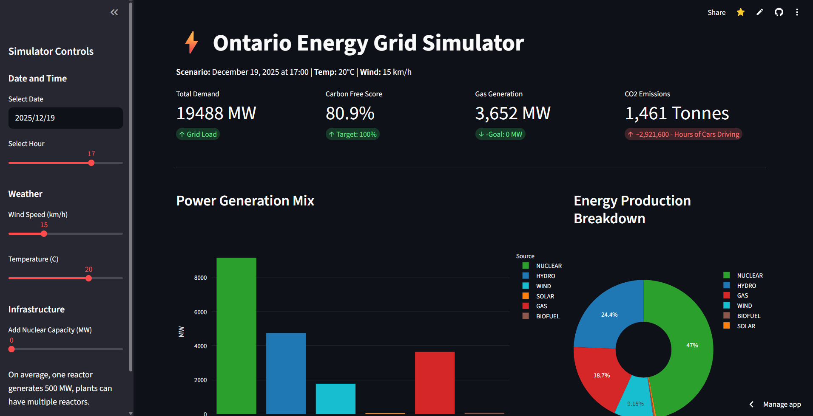

# ⚡ Ontario Energy Grid Simulator

### *A Machine Learning Dashboard for Predicting & Simulating Ontario's Power Grid*




## 📖 Overview
The **Ontario Energy Grid Simulator** is an end-to-end Machine Learning application that predicts electricity demand and generation mix based on weather conditions and time.

Beyond simple prediction, it serves as a **Policy Simulator**. It allows users to manipulate the grid's infrastructure (e.g., adding Nuclear capacity) to see real-time impacts on **Carbon Emissions** and grid stability. This project was built to explore how weather extremes drive natural gas usage and to visualize the environmental impact of energy policy decisions.

## 🚀 Key Features
* **🔮 Demand Forecasting:** Uses Random Forest regression to predict total grid load (MW) based on temperature, wind speed, and temporal features.
* **🔋 Supply Mix Prediction:** Estimates the real-time breakdown of energy sources (Nuclear, Hydro, Gas, Wind, Solar, Biofuel).
* **🎛️ Interactive Simulation:** A "What-If" engine that allows users to add/remove generation capacity and instantly see the effect on the grid's fuel mix.
* **🌍 Carbon Impact Analysis:** Live calculation of CO2 emissions, translating abstract "Tonnes of CO2" into relatable metrics like "Equivalent Cars off the Road."

## 🛠️ Tech Stack
* **Language:** Python 3.10+
* **Frontend:** Streamlit, Plotly
* **Machine Learning:** Scikit-Learn (Random Forest Regressors)
* **Data Processing:** Pandas, NumPy
* **Data Sources:** IESO (Independent Electricity System Operator), Open-Meteo API

## ⚙️ The Data Pipeline
This project implements a complete **ETL (Extract, Transform, Load)** pipeline to process raw energy data:

1.  **Ingestion:** Scrapes raw XML reports from the IESO database and fetches historical weather data via API.
2.  **Alignment:** Resolves timezone mismatches between grid data (Hour 1-24) and weather data (Hour 0-23).
3.  **Feature Engineering:** Transforms date timestamps into cyclical features (`DayOfYear`, `Weekday`, `Is_Weekend`) for the ML model.
4.  **Enrichment:** Calculates historical carbon intensity using emission factors (e.g., Gas = 490g CO2/kWh).
5.  **Training:** Optimized Random Forest models trained on historical data (2020-2025).

## 🧠 The Models
The system uses two coupled Machine Learning models:
* **Model A (Demand):** Predicts the total `MW` required by the province.
    * *Inputs:* Temperature, Day of Year, Hour, Weekend Flag.
* **Model B (Supply Mix):** A Multi-Output Regressor that predicts the generation of *each* fuel type.
    * *Inputs:* Predicted Total Demand (from Model A), Wind Speed.

## 💻 How to Run Locally

1.  **Clone the repository**
    ```bash
    git clone https://github.com/KushParmar07/Climate-Energy-Data-Dashboard.git
    cd Climate-Energy-Data-Dashboard
    ```

2.  **Install Dependencies**
    ```bash
    pip install -r requirements.txt
    ```

3.  **Run the App**
    ```bash
    streamlit run dashboard.py
    ```

---
*Built by Kush Parmar* - *[Linkedin](www.linkedin.com/in/kush-parmar-9430552b7)*